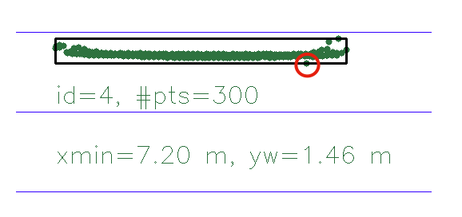
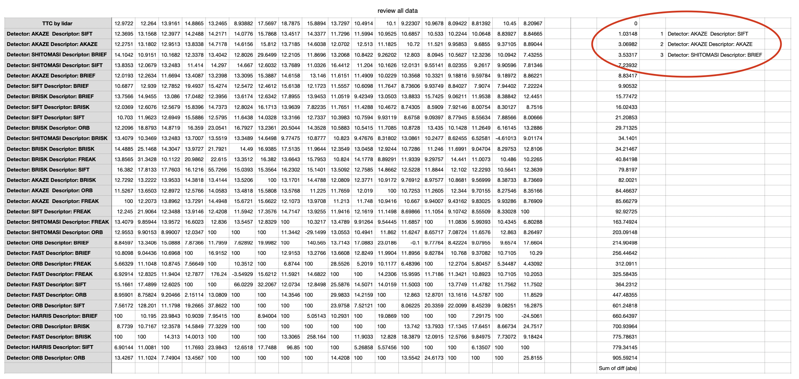

# SFND 3D Object Tracking

Welcome to the final project of the camera course. By completing all the lessons, you now have a solid understanding of keypoint detectors, descriptors, and methods to match them between successive images. Also, you know how to detect objects in an image using the YOLO deep-learning framework. And finally, you know how to associate regions in a camera image with Lidar points in 3D space. Let's take a look at our program schematic to see what we already have accomplished and what's still missing.


In this final project, you will implement the missing parts in the schematic. To do this, you will complete four major tasks: 
1. First, you will develop a way to match 3D objects over time by using keypoint correspondences. 
2. Second, you will compute the TTC based on Lidar measurements. 
3. You will then proceed to do the same using the camera, which requires to first associate keypoint matches to regions of interest and then to compute the TTC based on those matches. 
4. And lastly, you will conduct various tests with the framework. Your goal is to identify the most suitable detector/descriptor combination for TTC estimation and also to search for problems that can lead to faulty measurements by the camera or Lidar sensor. In the last course of this Nanodegree, you will learn about the Kalman filter, which is a great way to combine the two independent TTC measurements into an improved version which is much more reliable than a single sensor alone can be. But before we think about such things, let us focus on your final project in the camera course. 

## Dependencies for Running Locally
* cmake >= 2.8
  * All OSes: [click here for installation instructions](https://cmake.org/install/)
* make >= 4.1 (Linux, Mac), 3.81 (Windows)
  * Linux: make is installed by default on most Linux distros
  * Mac: [install Xcode command line tools to get make](https://developer.apple.com/xcode/features/)
  * Windows: [Click here for installation instructions](http://gnuwin32.sourceforge.net/packages/make.htm)
* Git LFS
  * Weight files are handled using [LFS](https://git-lfs.github.com/)
  * Install Git LFS before cloning this Repo.
* OpenCV >= 4.1
  * This must be compiled from source using the `-D OPENCV_ENABLE_NONFREE=ON` cmake flag for testing the SIFT and SURF detectors.
  * The OpenCV 4.1.0 source code can be found [here](https://github.com/opencv/opencv/tree/4.1.0)
* gcc/g++ >= 5.4
  * Linux: gcc / g++ is installed by default on most Linux distros
  * Mac: same deal as make - [install Xcode command line tools](https://developer.apple.com/xcode/features/)
  * Windows: recommend using [MinGW](http://www.mingw.org/)

## Basic Build Instructions

1. Clone this repo.
2. Make a build directory in the top level project directory: `mkdir build && cd build`
3. Compile: `cmake .. && make`
4. Run it: `./3D_object_tracking`.


## Final Project

1. FP.1: Match 3D objects
    * count each keypoints for every bounding boxes
    * If there are the most counters, it is judged that a match has been made.
``` cpp
void matchBoundingBoxes(std::vector<cv::DMatch> &matches, std::map<int, int> &bbBestMatches, DataFrame &prevFrame, DataFrame &currFrame)
{
    for (const auto prevBox : prevFrame.boundingBoxes)
    {
        int max_counter = 0;
        for (const auto currBox : currFrame.boundingBoxes)
        {
            int counter = 0;
            for (const auto match : matches)
            {
                const cv::Point2f prevPt = prevFrame.keypoints[match.queryIdx].pt;
                const cv::Point2f currPt = currFrame.keypoints[match.trainIdx].pt;

                if (prevBox.roi.contains(prevPt) && currBox.roi.contains(currPt))
                {
                    counter++;
                }
            }
            if (counter > max_counter)
            {
                max_counter = counter;
                bbBestMatches[prevBox.boxID] = currBox.boxID;
            }
        }
    }
}
```

2. FP.2: Compute Lidar-based TTC
    * find minimum x-direction distance both previous and current
    * And then calculate. TTC = minXCurr * dT / (minXPrev - minXCurr)
``` cpp
        for (auto it = lidarPointsPrev.begin(); it != lidarPointsPrev.end(); ++it)
    {
        minXPrev = minXPrev > it->x ? it->x : minXPrev;
    }

    for (auto it = lidarPointsCurr.begin(); it != lidarPointsCurr.end(); ++it)
    {
        minXCurr = minXCurr > it->x ? it->x : minXCurr;
    }
    TTC = minXCurr * dT / (minXPrev - minXCurr);
```

3. FP.3 : Associate Keypoint Correspondences with Bounding Boxes
    * check current point is in bounding box or not
    * if inside bounding box, add keypoint and match
    * To remove outlier, I used IQR method
``` cpp
void clusterKptMatchesWithROI(BoundingBox &boundingBox, std::vector<cv::KeyPoint> &kptsPrev, std::vector<cv::KeyPoint> &kptsCurr, std::vector<cv::DMatch> &kptMatches)
{
    vector<float> matchedDistances;
    float tempDistance;
    for (auto match : kptMatches)
    {
        const cv::KeyPoint kptPrev = kptsPrev[match.queryIdx];
        const cv::KeyPoint kptCurr = kptsCurr[match.trainIdx];
        tempDistance = sqrt(pow(kptPrev.pt.x-kptCurr.pt.x, 2) + pow(kptPrev.pt.y-kptCurr.pt.y, 2));
        matchedDistances.push_back(tempDistance);     
    }

    sort(matchedDistances.begin(), matchedDistances.end());

    const float Q1 = matchedDistances[matchedDistances.size() / 4];
    const float Q3 = matchedDistances[matchedDistances.size() * 3/ 4];
    const float IQR = Q3 - Q1;
    const float lowOutlier = Q1 - 1.5 * IQR;
    const float highOutlier = Q3 + 1.5 * IQR;

    for (auto match : kptMatches)
    {
        const cv::KeyPoint kptPrev = kptsPrev[match.queryIdx];
        const cv::KeyPoint kptCurr = kptsCurr[match.trainIdx];
        tempDistance = sqrt(pow(kptPrev.pt.x-kptCurr.pt.x, 2) + pow(kptPrev.pt.y-kptCurr.pt.y, 2));

        if (boundingBox.roi.contains(kptCurr.pt) && lowOutlier < tempDistance && tempDistance < highOutlier )
        {
            boundingBox.keypoints.push_back(kptCurr);
            boundingBox.kptMatches.push_back(match);
        }
    }
}
```


4. FP.4 : Compute Camera-based TTC
    * Make the ratio the distances each frame. (distCurr/ distPrev)
    * Calculate the TTC with median of ratio.
``` cpp
void computeTTCCamera(std::vector<cv::KeyPoint> &kptsPrev, std::vector<cv::KeyPoint> &kptsCurr, 
                      std::vector<cv::DMatch> kptMatches, double frameRate, double &TTC, cv::Mat *visImg)
{
    vector<double> distRatios;
    for (int i = 0; i < kptMatches.size(); i++)
    {
        const cv::KeyPoint originPrev = kptsPrev[kptMatches[i].queryIdx];
        const cv::KeyPoint originCurr = kptsCurr[kptMatches[i].trainIdx];
        for (int j = i; j < kptMatches.size(); j++)
        {
            const cv::KeyPoint kptPrev = kptsPrev[kptMatches[j].queryIdx];
            const cv::KeyPoint kptCurr = kptsCurr[kptMatches[j].trainIdx];
            const double distPrev = sqrt(pow(kptPrev.pt.x-originPrev.pt.x, 2) + pow(kptPrev.pt.y-originPrev.pt.y, 2));
            const double distCurr = sqrt(pow(kptCurr.pt.x-originCurr.pt.x, 2) + pow(kptCurr.pt.y-originCurr.pt.y, 2));
            distRatios.push_back(distCurr / distPrev);          
        }
    }
    // compute camera-based TTC from distance ratios
    double medianDistRatio;
    nth_element(distRatios.begin(), distRatios.begin() + distRatios.size() / 2, distRatios.end());
    medianDistRatio = distRatios[distRatios.size() / 2];
    double dT = 1 / frameRate;
    TTC = -dT / (1-medianDistRatio);
}
```

5. FP.5 : Performance Evaluation 1
    * Look for several examples where you have the impression that the Lidar-based TTC estimate is way off
    * provide a sound argumentation why you think this happened  
    * Good case  
      
      
    There is no outlier point in the two photos above
    
    * Bad case  
      
    purple point (above image, inside red circle) is outlier, but it does not affect ttc. because that point far from ego vehicle  
      
    green point (above image, inside red circle) is outlier, and it affect ttc. because that point affect x min value, and it makes ttc shorter than real world


    * To terminate outlier, I used Normal Distribution method. see below result  
      
      
  6. FP.6 : Performance Evaluation 2
     * Compare lidar ttc and camera ttc (all variation)
     * Rank performance
     #### 1st Rank. Detector: AKAZE, Descriptor: SIFT   
     #### 2nd Rank. Detector: AKAZE, Descriptor: AKAZE
     #### 3rd Rank. Detector: SHITOMASI, Descriptor: BRIEF
     * See below table (-inf or nan occur, I assigned 100 to calculate)



